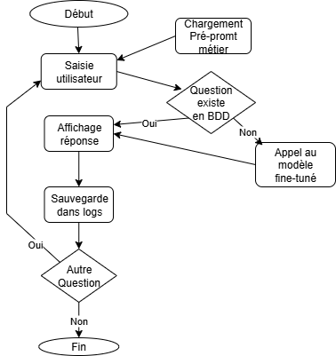

# CGVbot


> Assistant juridique spécialisé dans les Conditions Générales de Vente (CGV), utilisable en ligne de commande. Ce projet a été réalisé dans le cadre d’un exercice pédagogique sur le fine-tuning d’un modèle OpenAI.

---

## Table des matières

1. [Description](#description)
2. [Fonctionnalités](#fonctionnalités)
3. [Pré-requis](#pré-requis)
4. [Technologies et langages](#technologies-et-langages)
5. [Fonctionnement de l'algorithme](#fonctionnement-de-lalgorithme)
6. [Guide d'installation](#guide-dinstallation)
7. [Configuration de l’environnement](#configuration-de-lenvironnement)
8. [Utilisation du modèle fine-tuné](#utilisation-du-modèle-fine-tuné)
9. [Guide de développement](#guide-de-développement)
10. [Structure du projet](#structure-du-projet)
11. [Architecture du projet](#architecture-du-projet)
12. [Schéma de la base de données](#schéma-de-la-base-de-données)
13. [Licence](#licence)
14. [Créateurs du projet](#créateurs-du-projet)

---

## Description

CGVbot est un assistant conversationnel conçu pour répondre automatiquement aux questions juridiques relatives aux Conditions Générales de Vente (paiement, rétractation, livraison, garantie, données personnelles). Il s’appuie sur un modèle GPT-4.1 nano fine-tuné et fonctionne en ligne de commande :

1. L'utilisateur pose une question via la console (`app.py`)  
2. Le pré-prompt métier est injecté dans la requête  
3. La requête est envoyée au modèle fine-tuné via l'API OpenAI  
4. La réponse est affichée dans la console  
5. L'échange est enregistré dans la base MySQL  
6. Adminer permet de consulter les logs via le conteneur Docker

---

## Fonctionnalités

- Chargement d’un pré-prompt métier
- Interaction en ligne de commande via `app.py`
- Appel à un modèle GPT-4.1 nano fine-tuné sur des CGV au format `.jsonl`  
- Affichage des réponses dans la console Python  
- Enregistrement des échanges dans une base MySQL
- Vérification des doublons avant appel à l'API
- Gestion des erreurs API avec enregistrement du statut dans la base
- Consultation des logs via Adminer, accessible dans le conteneur Docker
- Scripts Python pour uploader les données et lancer le fine-tuning via l'API OpenAI  

---

## Pré-requis

- Python 3.10+  
- Accès à l’API OpenAI avec droits de fine-tuning  
- Docker installé et configuré  
- Git installé  

---

## Technologies et langages

| Outil / Langage     | Usage                                  |
|---------------------|----------------------------------------|
| Python              | Backend et logique métier              |
| OpenAI API          | Fine-tuning et génération de réponses  |
| MySQL               | Stockage des logs                      |
| Docker + Adminer    | Conteneurisation et visualisation DB   |
| JSONL               | Format d’entraînement du modèle        |
| Git / GitHub        | Versioning et dépôt du projet          |

---

## Fonctionnement de l'algorithme

1. Chargement du pré-prompt métier
2. Saisie utilisateur via la console
3. Vérification si la question existe déjà en base
4. Si oui → réponse affichée directement
5. Si non → appel au modèle fine-tuné via l’API OpenAI
6. Affichage de la réponse
7. Enregistrement dans la base MySQL
8. Possibilité de poser une nouvelle question



---

## Guide d'installation

```bash
# Création de l'environnement virtuel
python3 -m venv .venv
source .venv/bin/activate

# Installation des dépendances
pip install -r requirements.txt

# Lancement de l'application
python app.py
```
---

## Configuration de l’environnement 

Avant d’utiliser les scripts `addfile.py` et `finetuning.py`, créer un fichier `.env` à la racine du projet contenant la clé API OpenAI :

OPENAI_API_KEY=sk-xxxxxxxxxxxxxxxxxxxxxxxxxxxxxxxxxxxxxxxx
 
Ce fichier ne doit pas être versionné (voir `.gitignore`) afin de préserver la confidentialité de vos identifiants. Le script `finetuning.py` récupère cette clé via la fonction `os.getenv("OPENAI_API_KEY")`. 
Assurez-vous que le nom de la variable dans `.env` correspond exactement à celui utilisé dans le code. 

Cette méthode permet de sécuriser l’accès à l’API et d’éviter toute fuite accidentelle lors du partage du projet.

---

## Utilisation du modèle fine-tuné 

Le modèle est entraîné à partir du fichier `train/train.jsonl` via l’API OpenAI.
Les scripts `addfile.py` et `finetuning.py` permettent de : 
- Uploader le fichier d’entraînement
- Lancer le fine-tuning sur le modèle GPT-4.1 nano

Une fois le modèle fine-tuné, il est appelé dans `app.py` pour générer les réponses.

---

## Guide de développement

- `app.py` : logique principale du chatbot (interface console)
- `main.py` : script principal pour tester et enregistrer les échanges
- `sql.py` : gestion des interactions avec la base MySQL  
- `train/train.jsonl` : exemples utilisés pour le fine-tuning du modèle GPT
- `train/addfile.py` : script pour uploader le fichier JSONL sur OpenAI
- `train/finetuning.py` : script pour lancer le finetuning via l'API OpenAI
- Table `logs` : enregistrement des prompts et réponses dans la base MySQL 

---

## Structure du projet

```plaintext
cgvbot/
├── app.py                # Interface console principale
├── sql.py                # Gestion des interactions avec MySQL
├── main.py               # Script principal : appel à l’API + enregistrement dans la base
├── test_api.py           # Test de connectivité avec l'API OpenAI (ancien test simple)
├── train/                # Dossier dédié à l'entraînement du modèle
│   ├── addfile.py        # Script d’upload du fichier JSONL vers OpenAI  
│   ├── finetuning.py     # Script de lancement du fine-tuning 
│   └── train.jsonl       # Données d'entraînement pour le fine-tuning
├── docs/                 
│   └── organigramme.png  # Organigramme du fonctionnement
├── .env                  # Clé API OpenAI (non versionnée)  
├── .gitignore            # Fichiers à exclure du dépôt
├── .dockerignore         # Fichiers ignorés lors du build Docker 
├── requirements.txt      # Dépendances Python du projet    
├── docker-compose.yml    # Orchestration des services (Adminer + app)
├── Dockerfile            # Configuration du conteneur
└── README.md             # Documentation du projet
```

---

## Architecture du projet

Le projet CGVbot repose sur une architecture modulaire articulée autour de quatre composants principaux :

```
+---------------------+
|     app.py          | <-- Interface console utilisateur
+---------------------+
          |
          v
+---------------------+        +---------------------+
|   OpenAI API        |<-----> |   train.jsonl       | <-- Données d'entraînement
+---------------------+        +---------------------+
          |
          v
+---------------------+
|   Pré-prompt métier | <-- Chargé depuis config.json
+---------------------+
          |
          v
+---------------------+
|   MySQL  (logs)     | <-- Stockage des échanges
+---------------------+
          |
          v
+---------------------+
|   Adminer (Docker)  | <-- Visualisation de la base
+---------------------+
```

---

## Schéma de la base de données

La base MySQL utilisée par **CGVbot** contient une seule table principale : `logs`.  
Elle permet de stocker chaque interaction entre l’utilisateur et le modèle fine-tuné.

| Champ       | Type          | Description                                 |
|-------------|---------------|---------------------------------------------|
| `id`        | `INTEGER`     | Identifiant unique (clé primaire)           |
| `prompt`    | `TEXT`        | Question posée par l’utilisateur            |
| `response`  | `TEXT`        | Réponse générée par le modèle               |
| `timestamp` | `DATETIME`    | Date et heure de l’échange                  |
| `status`    | `VARCHAR(50)` | État ou statut de la réponse (optionnel)    |

Cette base est automatiquement alimentée à chaque requête via `sql.py`.  
Elle est consultable via **Adminer**, directement dans le conteneur Docker.

---

## Licence

Ce projet est réalisé dans un cadre pédagogique. Le code est mis à disposition sous la licence MIT.

---

## Créateurs du projet

### - Carole Novak       [GitHub](https://github.com/Carole-N/cgvbot) • [LinkedIn](https://www.linkedin.com/in/carole-novak-76a69a269/)

### - Lucas Henneuse       [GitHub](https://github.com/lucasHENNEUSE/cgvbot) • [LinkedIn](https://www.linkedin.com/in/lucas-henneuse-21076325a/)
